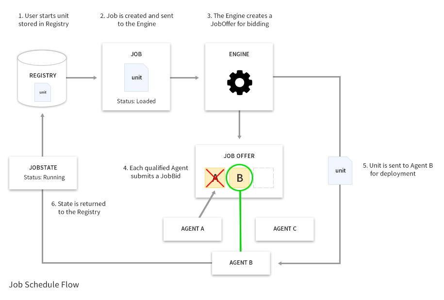

# Architecture

There exist two primary roles within fleet: Engine and Agent. Each `fleet` daemon running in a cluster fulfills both roles. An Engine primarily makes scheduling decisions while an Agent executes jobs.

## Moving Parts

### Engine

The most important responsibility of an Engine is that of scheduling Jobs. An Engine offers Jobs to Agents in the cluster, gathers JobBids in response to those JobOffers, and decides which Agent will actually run those Jobs. 

**NOTE:** The current scheduling algorithm used by an Engine is not fair. It simply accepts the first JobBid.

An Engine is also responsible for reacting to cluster membership changes. The loss of a Machine triggers the rescheduling of that Machine's Jobs by a given Engine.

### Agent

An Agent is responsible for executing Jobs. To do this, an Agent must first bid on a JobOffer. An Agent will not bid on any Jobs for which it does not meet the requirements.

All outstanding JobOffers and JobBids are tracked by an Agent internally to facilitate rescheduling in response to failures. Once a JobOffer is announced as resolved (i.e. the Job is scheduled), the JobOffer and JobBid state is purged from a given Agent.

If an Agent's JobBid is accepted, that Agent will run the Job by instructing its local instance of systemd to start the Job's payload. The Agent then subscribes to relevant D-Bus events which, when received, are published to the cluster.

If an Agent's JobBid is rejected, that Agent simply forgets about it and moves on.

### Registry

The Registry is the sole datastore in a fleet cluster. All persistent and ephemeral data is stored in the registry: unit files, cluster presence, job state, etc.

**NOTE:**The backing store is currently the distributed locking service [etcd](https://github.com/coreos/etcd). This will continue to support fleet at a small scale, but scaling fleet up will require a redesign of the underlying datastores used by the Registry.

### Events

There are four key pieces to the event system in fleet: the EventBus, EventStreams, EventListeners and Events. EventStreams generate Events, streaming them to the EventBus, which then distributes them amongst its registered EventListeners.

The Event is a simple data object. It has a name, a payload, and an optional context. The name is a canonical representation of what happened, the payload is the relevant data that has changed, and the context represents in what namespace the event happened (i.e. a specific machine, job, etc).

The Engine and Agent each have EventListeners which understand how to manipulate their respective components in response to Events.

There are two EventStreams in fleet. The first watches etcd for changes, while the second subscribes to D-Bus events.

## Object Model

### User-facing Objects

#### Jobs and Payloads

A JobPayload represents a single systemd service or socket. Once a JobPayload is pushed to the cluster, it is immutable. A JobPayload must be destroyed and re-submitted for any modifications to be made.

The payload may define a set of requirements that must be fulfilled by a given host in order for that host to run the payload. These requirements can include resources, host metadata, locality relative to other payloads, etc.

A Job represents a request to run a specific JobPayload in the cluster. All Jobs are treated as services rather than batch processes.

When creating a Job, a user may provide additional requirements that must be respected in addition to the requirements of the Job's payload. Once a Job has been started, no other Jobs may be started with its payload.

Stopping a Job is a destructive action - no metadata is preserved. The Job's payload, however, is not removed from the cluster and subsequent Jobs may use it.

#### State

Both Jobs and Machines have dynamic state which is published both for the user and cluster to consume.

A JobState object represents the state of a payload as reported by systemd on a given Machine. Only the Machine running an actual Job will publish a corresponding JobState object.

A MachineState object represents the state of a host in the cluster at the time the object was generated. MachineState objects are published on an interval with a TTL, keeping the external view of a cluster relatively accurate at any given time.

### Internal Objects

#### Offers and Bids

A JobOffer is created by an Engine to represent the need to schedule a given Job. The Engine is essentially broadcasting, "Who can run this Job?"

A JobBid represents a single Agent's request to run a Job. A JobBid will only be created by Agents that have compared their current capabilities to the requirements of a given Job.

Once an Engine receives enough bids in response to a given offer, it makes a scheduling decision and destroys that offer.

#### Machine

The Machine object acts as a factory for MachineState objects. It is shared between several internal components of fleet to ensure the view of the host is consistent at any given point in time.

## Putting it All Together

The following demonstrates how the above objects and components interact with one another:

