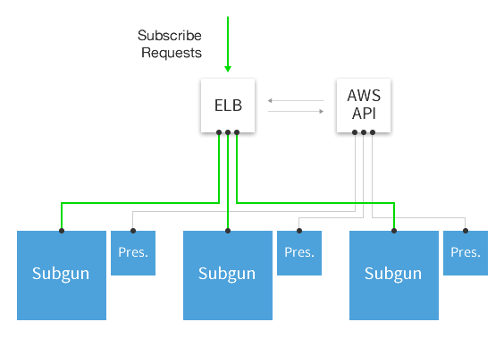

# Deploying a Service Using fleet

The following is an example of how one might deploy a load-balanced web service using fleet. 
This example deploys [subgun](https://github.com/coreos/subgun), a simple subscription tool for [mailgun](https://mailgun.com/). 

subgun is deployed in two pieces: an application and a presence daemon. The application simply serves HTTP requests through an AWS load balancer, while the presence daemon updates the load balancer with backend information. The diagram below illustrates this model:



## Containers

Both components are deployed in [docker](https://www.docker.io/) containers running on CoreOS. The following Dockerfiles were each built and their resulting images pushed to the public docker index:

**coreos/subgun**

```
FROM stackbrew/ubuntu:precise
RUN apt-get install -y --allow-unauthenticated ca-certificates

ADD bin/subgun /bin/

EXPOSE 8080
ENV SUBGUN_LISTEN 127.0.0.1:8080
CMD /bin/subgun
```

**coreos/elb-presence**

```
FROM stackbrew/ubuntu:precise

RUN apt-get update
RUN apt-get install -y python-requests python-boto

ADD bin/elb-presence /bin/elb-presence

CMD /bin/elb-presence
```

## Service Files

With the docker images available over the public internet, systemd can simply run the containers. The following templates are rendered with all configuration information and the <N> field replaced with a unique integer per pair:

**subgun.\<N>.service**

```
[Unit]
Description=SUBGUN

[Service]
ExecStart=/usr/bin/docker run -rm -name subgun-cont -e SUBGUN_LISTS=<LIST> -e SUBGUN_API_KEY=<KEY> -p 8080:8080 coreos/subgun
ExecStop=/usr/bin/docker kill subgun-cont

[X-Fleet]
X-Conflicts=subgun.*.service
```

**subgun-presence.\<N>.service**

```
[Unit]
Description=subgun presence service
BindsTo=subgun.service

[Service]
ExecStart=/usr/bin/docker run -rm -name subgun-presence -e AWS_ACCESS_KEY=<ACCESS> -e AWS_SECRET_KEY=<SECRET> -e AWS_REGION=<REGION> -e ELB_NAME=<ELB_NAME> coreos/elb-presence
ExecStop=/usr/bin/docker kill subgun-presence

[X-Fleet]
X-ConditionMachineOf=subgun.<N>.service
```

## Deploy!


At this point, it is simple enough to hand the two unit files over to fleet:

```
$ fleetctl submit subgun-presence.*.service subgun.*.service
$ fleetctl list-units
UNIT						LOAD	ACTIVE	SUB	DESC	MACHINE
subgun-presence.1.service	-		-		-	-		-
subgun-presence.2.service	-		-		-	-		-
subgun-presence.3.service	-		-		-	-		-
subgun.1.service			-		-		-	-		-
subgun.2.service			-		-		-	-		-
subgun.3.service			-		-		-	-		-
```

And now they can be started:

```
$ fleetctl start subgun-presence.*.service subgun.*.service
$ fleetctl list-units
UNIT						LOAD	ACTIVE	SUB		DESC	MACHINE
subgun-presence.1.service	loaded	active	running	-		148a18ff...
subgun-presence.2.service	loaded	active	running	-		3caa7b7d...
subgun-presence.3.service	loaded	active	running	-		491586a6...
subgun.1.service			loaded	active	running	-		148a18ff...
subgun.2.service			loaded	active	running	-		3caa7b7d...
subgun.3.service			loaded	active	running	-		491586a6...
```

At this point, our application is deployed!
